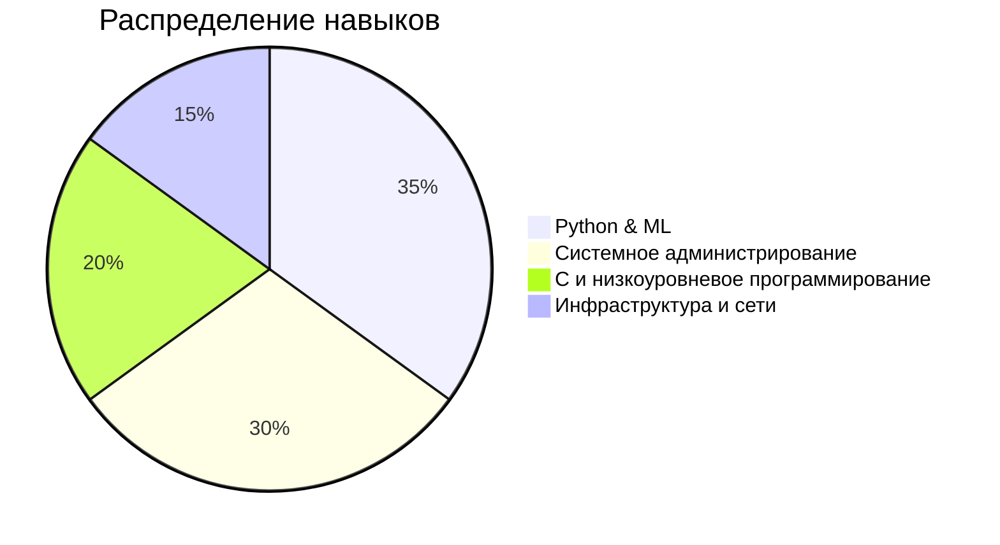

## 📊 Статистика GitHub

---

## стек

### 💻 Языки программирования

### 🐧 Системное администрирование

### 🐳 Контейнеризация и веб

### 📊 Визуализация стека технологий

```mermaid
pie title Распределение навыков
    "Python & ML" : 35
    "Системное администрирование" : 30
    "C и низкоуровневое программирование" : 20
    "Инфраструктура и сети" : 15
```